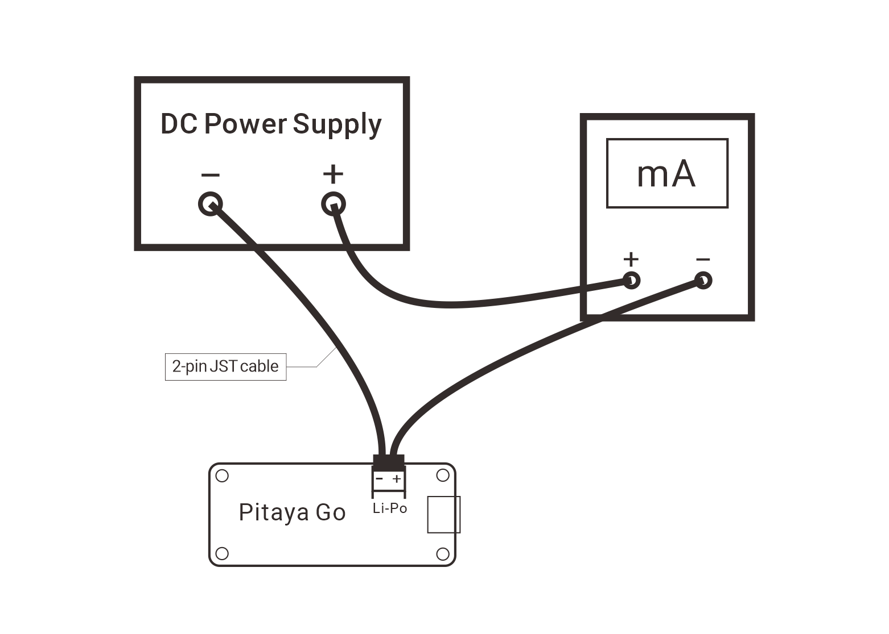

# Power Profiler Example

## Description

The Power Profiler Example demonstrates how to place the board into a minimum power consumption state and measure the power consumed.

This example application starts up, sends the Deep Power-down (DP) instruction to the QSPI flash memory, disables the Wi-Fi module, and enters the System OFF mode. The power consumed can be measured by using a digital multimeter.

!!! Tip
	Before you start building, remember to set up the nRF5 SDK development environment first. See [Setup the nRF5 SDK](../setup-the-nrf5-sdk.md) for details.

## Hardware Prerequisites

* Pitaya Go board
* Digital Multimeter
* DC Power Supply
* A 2-pin JST cable

## Building the example

You can find the source code and the project file of the example in the following folder: [pitaya-go/examples/peripheral/power_profile](https://github.com/makerdiary/pitaya-go/tree/master/examples/peripheral/power_profile).

Open terminal and navigate to the directory with the example Makefile:

``` sh
cd ./pitaya-go/examples/peripheral/power_profile
```

Run `make` to build the example:

``` sh
make
```

## Programming the firmware

If compiled successfully, the firmware is located in `power_profile/armgcc/_build` with the name `nrf52840_xxaa.hex`.

While pushing the **USER** button, press the **RESET** button to enter the DFU mode. Then program the firmware using the [nRF Connect for Desktop](https://www.nordicsemi.com/Software-and-Tools/Development-Tools/nRF-Connect-for-desktop) tool.

!!! Tip
	See **[Programming](../../programming.md)** section for details about how to program your Pitaya Go.


## Testing

Measure the power consumed by performing the following steps:

1. Follow the figure below to setup the hardware for current measurements:

	

2. The current measurements can be done over Digital Multimeter once the current remains constant.

## Create an Issue

Interested in contributing to this project? Want to report a bug? Feel free to click here:

<a href="https://github.com/makerdiary/pitaya-go/issues/new"><button data-md-color-primary="marsala"><i class="fa fa-github"></i> Create an Issue</button></a>

