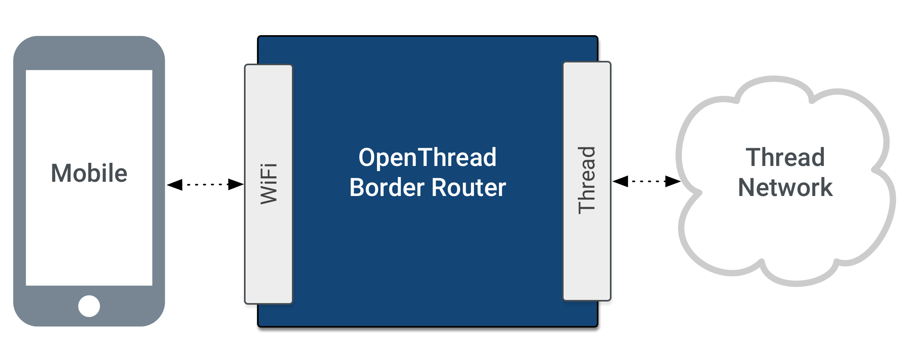
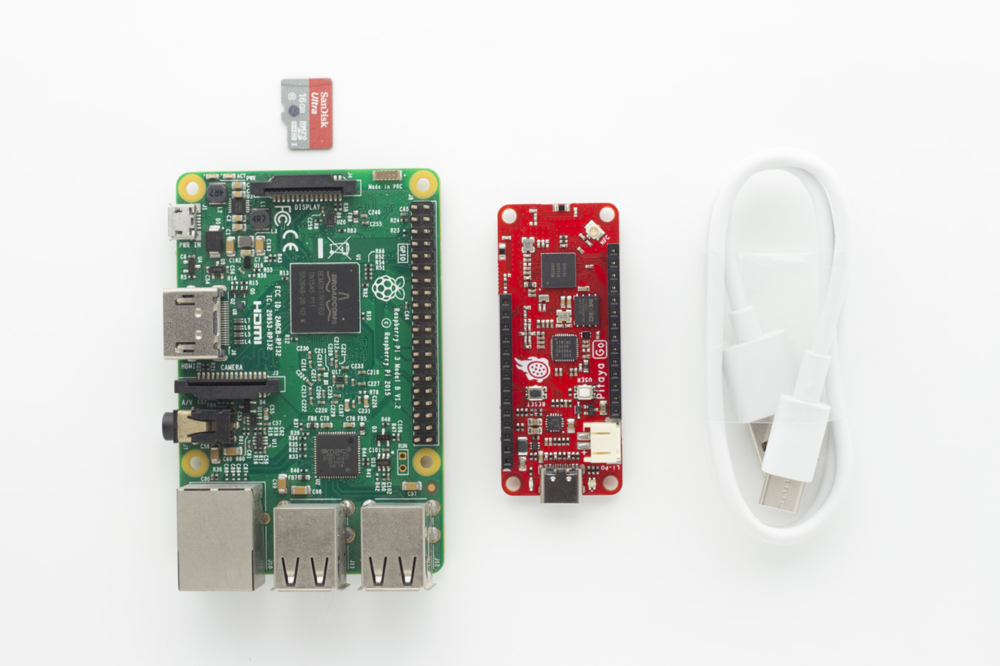
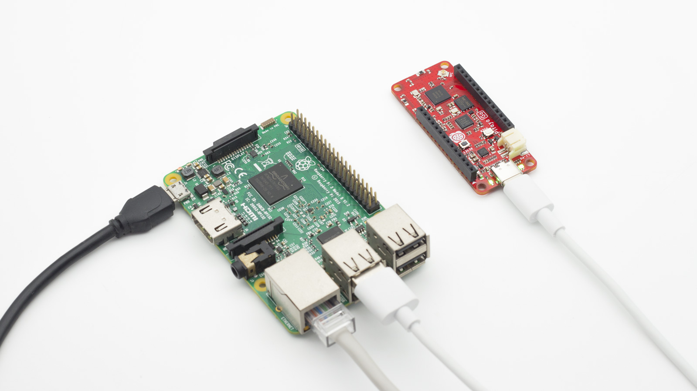
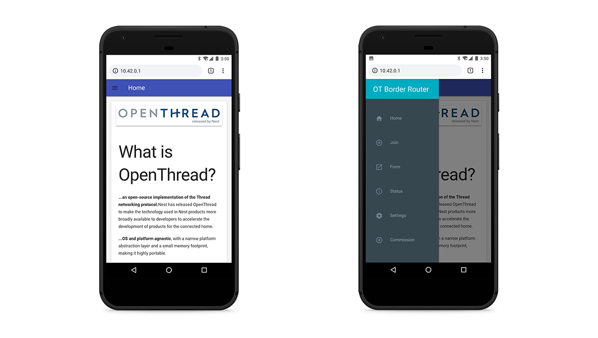
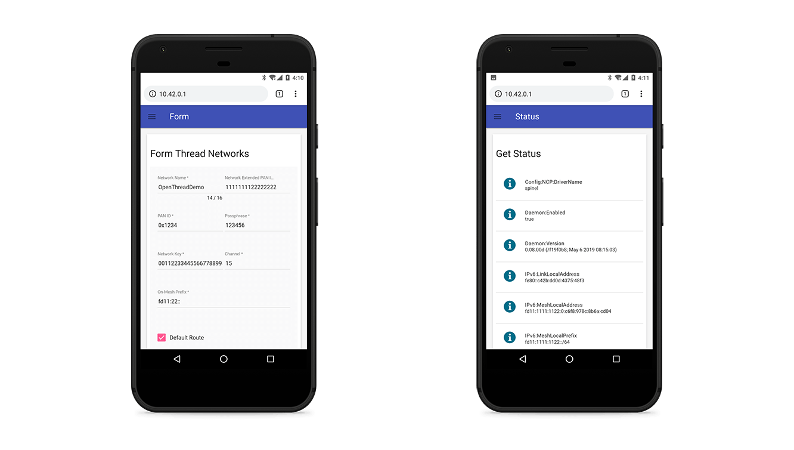
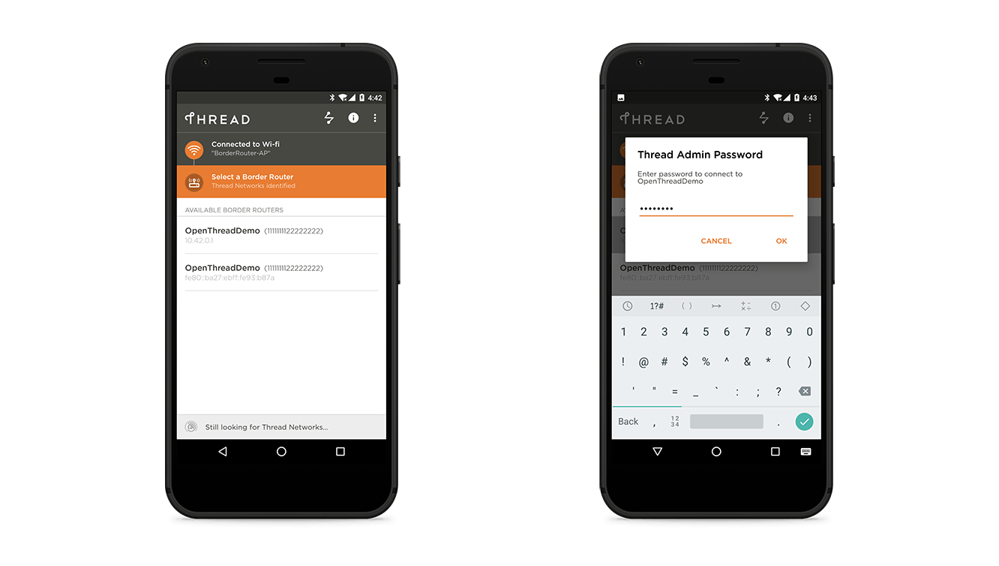
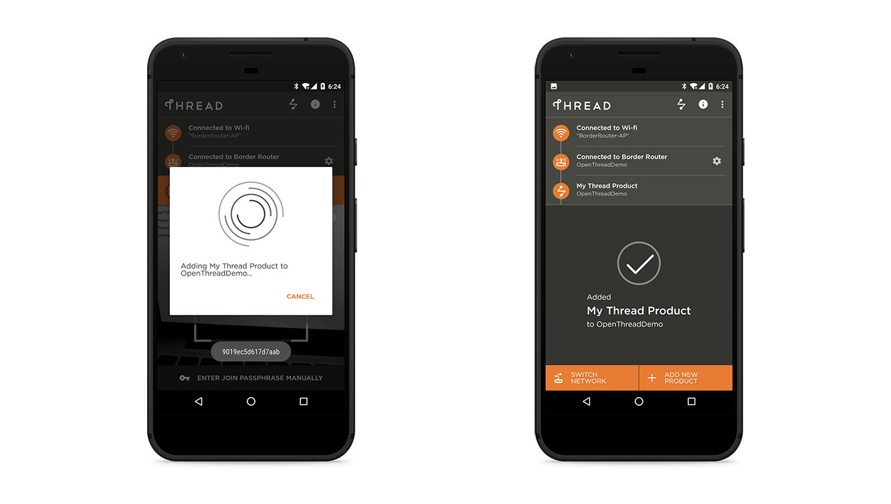

# OpenThread Border Router

## Introduction

A Thread Border Router serves as a gateway between the Internet and the Thread network. OpenThread's implementation of a Border Router is called OpenThread Border Router (OTBR). OTBR is a Thread Certified Component on the Raspberry Pi 3B with a Nordic nRF52840 NCP.



A Thread Border Router minimally supports the following functions:

* End-to-end IP connectivity via routing between Thread devices and other external IP networks

* External Thread Commissioning (for example, a mobile phone) to authenticate and join a Thread device to a Thread network

For more technical details, [openthread.io](https://openthread.io/guides/border_router) is the best place for you.

In the following section, you'll build an OpenThread Border Router with Raspberry Pi 3B and Pitaya Go.

## Hardware Requirements

* Raspberry Pi 3B
* Pitaya Go
* 4 GB (or larger) microSD card and microSD card reader
* microUSB power supply for Raspberry Pi 3B



## Set Up Raspberry Pi 3B

### Download and install Raspbian

Download the [RASPBIAN STRETCH LITE](https://www.raspberrypi.org/downloads/raspbian/) image to your host and follow the [installation guide](https://www.raspberrypi.org/documentation/installation/installing-images/README.md) to install the image on an microSD card.

### Flash the NCP firmware

OTBR runs on an NCP design. The pre-built firmware is located in the following folder: [pitaya-go/firmware/openthread/ncp](https://github.com/makerdiary/pitaya-go/tree/master/firmware/openthread/ncp) with the name `thread_ncp_ftd_usb_pitaya_go_vx.x.x`.

While pushing the **USER** button, press the **RESET** button to enter the DFU mode. Then program the NCP firmware using the [nRF Connect for Desktop](https://www.nordicsemi.com/Software-and-Tools/Development-Tools/nRF-Connect-for-desktop) tool.

!!! Tip
	See **[Programming](../programming.md)** section for details about how to program your Pitaya Go.

### Set up the Border Router

!!! Warning
	Before you continue, make sure your Raspberry Pi 3B is connected to the internet using Ethernet. The **bootstrap** script disables the platform's Wi-Fi interface and the **setup** script requires internet connectivity to download and install **wpantund**.

OTBR communicates with the Pitaya Go(serves as NCP) via `wpantund`. On Raspberry Pi 3B:

1. Clone the OTBR repository:
	``` sh
	git clone https://github.com/openthread/ot-br-posix
	```

2. Install dependencies:
	``` sh
	cd ot-br-posix
	```
	``` sh
	./script/bootstrap
	```

3. Compile and install OTBR and `wpantund`. Note that this setup script uses Network Manager to automatically set up the Wi-Fi access point (AP):
	``` sh
	./script/setup
	```

4. Attach the Pitaya Go to the Raspberry Pi 3B via USB.

5. Configure the NCP device's serial port in `wpantund`:
	
	* Determine the serial port name for the NCP device by checking /dev:
	``` sh
	ls /dev/tty*
	```

	* Add the serial port name to `/etc/wpantund.conf`. For example, for a serial port name of `ttyACM0`:
	``` sh
	Config:NCP:SocketPath "/dev/ttyACM0"
	```

6. Restart the Border Router. The OTBR service should start on boot.

	``` sh
	sudo reboot
	```

	

### Verify services

Verify that all required services are enabled:

``` sh
sudo systemctl status
```

If the `setup` script above was successful, the RPI3B is in `running` state and the following services appear in the output:

* `wpantund.service`
* `avahi-daemon.service`
* `otbr-web.service`
* `otbr-agent.service`

If the RPI3B is in **degraded** state, some other service has failed to start. Check to see which:

``` sh
sudo systemctl --failed
```

If the failed service is **tayga** or **dnsmasq**, it is normal. These services are completely configured as part of the [Wi-Fi Access Point Setup](https://openthread.io/guides/border-router/access-point).

### Verify NCP

Verify that the NCP is in the correct state:

``` sh
sudo wpanctl status
```

`wpanctl` is a command line utility provided with `wpantund`. It is used to communicate with the wireless PAN interface (default is `wpan0`) that `wpantund` is bound to in the NCP design.

If the NCP is successfully running OpenThread and is not a member of a Thread network, the output should be similar to the below:

``` sh
wpan0 => [
        "NCP:State" => "offline"
        "Daemon:Enabled" => true
        "NCP:Version" => "OPENTHREAD/20180926-00632-g2279ef61; NRF52840; May 23 2019 20:44:20"
        "Daemon:Version" => "0.08.00d (/f19f0b8; May  6 2019 08:15:03)"
        "Config:NCP:DriverName" => "spinel"
        "NCP:HardwareAddress" => [F4CE36BE641F74BC]
]
```

If the `NCP:State` is `uninitialized`, troubleshoot with the following:

1. Verify the RPI3B has sufficient power (use the proper external AC adapter).
2. Disconnect and reconnect the NCP device to the RPI3B.
3. Verify that the NCP serial device is present. For example, if the device should be attached to `/dev/ttyACM0`:

	``` sh
	ls /dev/ttyACM*
	/dev/ttyACM0
	```

4. Reset the NCP with `sudo wpanctl reset`.
5. Check the NCP status again with `sudo wpanctl status`.

## Use the Web GUI

Now, you can use the OpenThread Border Router (OTBR) Web GUI to configure and form, join, or check the status of a Thread network.

The Border Router enables Access Point mode and advertises the **BorderRouter-AP** network default. 

Connect to the **BorderRouter-AP** Wi-Fi network and access the Web GUI by visiting the OTBR's local IPv4 address(`10.42.0.1` default) in a mobile browser:

[](assets/images/otbr-web-gui.png)

### Form a Thread network

Use the **Form** menu option to create a new Thread network.

Observe that GREEN LED on Pitaya Go is lit. Confirm by checking the **Status** menu option or running `sudo wpanctl status` on the command line of the OTBR:

[](assets/images/form_n_check_thread_network.png)


## External Thread Commissioning

OpenThread Border Router (OTBR) features a Thread Border Agent, which supports external Thread Commissioning. In external Thread Commissioning, a device outside of the Thread network (for example, a mobile phone) commissions new devices onto the network.

### Prepare the Joiner device

You should prepare another Pitaya Go board. Flash the board with the OpenThread CLI firmware. The pre-built CLI firmware is located in [pitaya-go/firmware/openthread/cli](https://github.com/makerdiary/pitaya-go/tree/master/firmware/openthread/cli).

1. Connect the new Pitaya Go board to your PC using the USB-C cable.

2. While pushing the **USER** button, press the **RESET** button to enter the DFU mode. Then program the OpenThread CLI firmware.

3. Open a terminal window and run:
	``` sh
	screen /dev/cu.usbmodemDB71638B4DB62 115200
	```
	where `/dev/cu.usbmodemDB71638B4DB62` is the serial port name of the Joiner.

4. Once the Joiner device is ready, retrieve the factory-assigned IEEE EUI-64. Use the `eui64` command in the OpenThread CLI:
	``` sh
	> eui64
	f4ce3638d6b665ce
	Done
	```

### Use the Thread Commissioning App

External commissioning is supported by the Thread Commissioning App, available for download on the Google Play Store for Android devices.

<a href="https://play.google.com/store/apps/details?id=org.threadgroup.commissioner&hl=en"><button data-md-color-primary="marsala" style="width: auto;">Thread Commissioning App</button></a>

Connect your phone to the Wi-Fi access point **BorderRouter-AP**, and start the Thread Commissioning App.

Select the target Border Router from the available list. The name is the same as the Thread network created by the OTBR Web GUI. If the same Border Router shows up multiple times with different IPv4 and IPv6 addresses, select the one with the static IPv4 address used for the Wi-Fi access point setup (`10.42.0.1` here).

When prompted for a password, enter the passphrase (Commissioner Credential) set by the OTBR Web GUI.

[](assets/images/connect-to-border-router.png)

### Commission the Joiner

After connected to the Border Router, the app provides the option to scan a Connect QR Code or enter a Join Passphrase manually.

Thread Connect QR Codes are created with the following text string format:

``` sh
v=1&&eui=f4ce3638d6b665ce&&cc=J01NU5
```
Where `eui` is the Joiner device's EUI64 value and `cc` is the Joiner Credential.

Use the following tool to generator your QR Code:

<input type="text" id="text_usr" style="width: 50%; font-size: 85%" placeholder="Input your text here..." autocapitalize="off" autocorrect="off" autocomplete="off" spellcheck="false">

<button id="btn_generate" data-md-color-primary="marsala">Generate</button>

<div id="output"></div>

<script src="https://ajax.googleapis.com/ajax/libs/jquery/1.5.2/jquery.min.js"></script>
<script>
jQuery(function(){
	jQuery( "#btn_generate" ).click(function() {
		var text = $('#text_usr').val();
		if(text != "")
		{
			jQuery('#output').empty();
			jQuery('#output').qrcode({width: 200,height: 200,text: text});
		}
	});
})
</script>

In the Thread Commissioning App, scan the Connect QR Code generated above. While the app is waiting, enter the OpenThread CLI on the Joiner device and start the Joiner role with that same Joiner Credential:

``` sh
> ifconfig up
Done
> joiner start J01NU5
Done
```

Wait for the DTLS handshake to complete between the Commissioner and Joiner:
``` sh
> Join success
```

[](assets/images/adding-device-via-qrcode.png)

### Join the network

On the Joiner device, start the Thread protocol to automatically join the network.

``` sh
> thread start
Done
```

Check the state after a few moments to confirm. It may initially start as a Child, but within two minutes, it will upgrade to a Router.

``` sh
> state
router
Done
```

Obtain the addresses of the joiner by typing ipaddr:

``` sh
> ipaddr
fd11:1111:1122:0:0:ff:fe00:4800
fd11:22:0:0:f8f8:d11:2fe1:64c
fd11:1111:1122:0:86ab:6ec9:2c76:b685
fe80:0:0:0:a8f7:dc05:2d33:c107
Done
```

## Check the Internet connectivity

Test the connectivity between the Joiner device in the Thread network and the Internet by pinging a public IPv4 address. To reach the IPv4 address from the Thread device, a Well-Known Prefix of `64:ff9b::/96` and an IPv4 address of the destination are used.

For example, to ping Google’s DNS `8.8.8.8` from the IPv6 address, append a hexadecimal form of the IPv6 to the Well-Known Prefix resulting in: `64:ff9b::808:808`.

``` sh
> ping 64:ff9b::808:808
> 16 bytes from 64:ff9b:0:0:0:0:808:808: icmp_seq=1 hlim=43 time=234ms

> ping 64:ff9b::808:808
> 16 bytes from 64:ff9b:0:0:0:0:808:808: icmp_seq=2 hlim=43 time=229ms

> ping 64:ff9b::808:808
> 16 bytes from 64:ff9b:0:0:0:0:808:808: icmp_seq=3 hlim=44 time=225ms

> ping 64:ff9b::808:808
> 16 bytes from 64:ff9b:0:0:0:0:808:808: icmp_seq=4 hlim=45 time=221ms
```

## Congratulations!

You've successfully created an OpenThread Border Router, while allowing the Joiner device in the Thread network communicating with the Internet.


## License

Portions of this page are reproduced from work created and [shared by Google](https://developers.google.com/readme/policies/) and used according to terms described in the [Creative Commons 3.0 Attribution License](https://creativecommons.org/licenses/by/3.0/).

Thread is a registered trademark of the [Thread Group, Inc](https://www.threadgroup.org/).


## Create an Issue

Interested in contributing to this project? Want to report a bug? Feel free to click here:

<a href="https://github.com/makerdiary/pitaya-go/issues/new"><button data-md-color-primary="marsala"><i class="fa fa-github"></i> Create an Issue</button></a>


